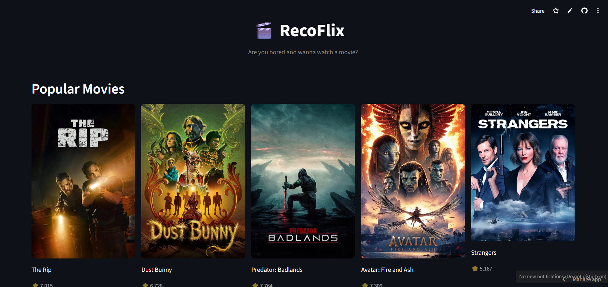
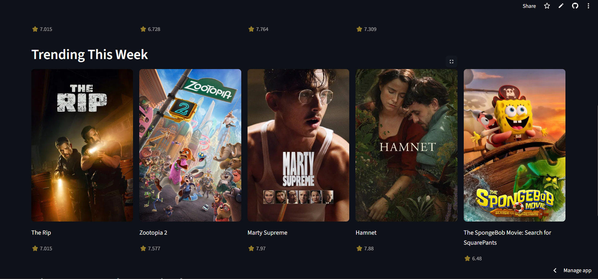
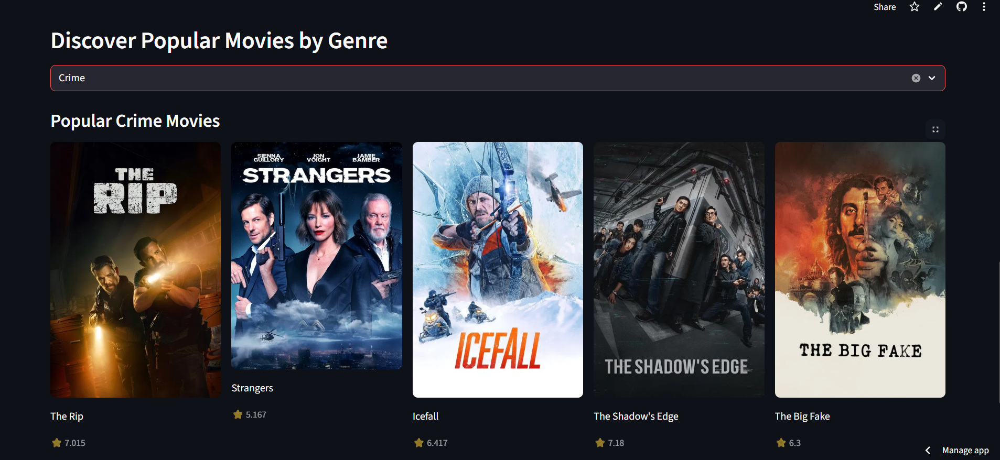
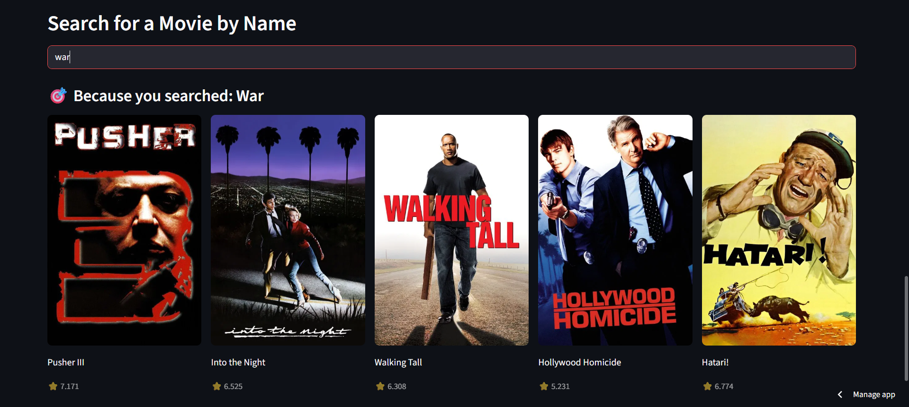

# 🎬 RecoFlix – AI Movie Recommendation System

RecoFlix is a movie discovery and recommendation web application that helps users explore popular, trending, and similar movies through an intuitive interface.

The project demonstrates how **recommendation systems and personalization algorithms** can improve content discovery experiences in streaming platforms.

🔗 Live Demo: https://recoflix.streamlit.app/

---

# 📌 Overview

Streaming platforms host thousands of movies, making it difficult for users to discover content aligned with their interests.

RecoFlix addresses this challenge by providing:

• browsing of popular movies  
• trending movie discovery  
• genre-based exploration  
• similar movie recommendations  

The application integrates real-time data from the TMDB API and presents it through a clean interactive interface.

---

# ✨ Features

• Browse currently popular movies  
• View weekly trending movies  
• Discover movies by genre  
• Search for a movie and get similar recommendations  
• Real-time data fetched from the TMDB API  
• Simple and interactive Streamlit interface  

---

# 🧠 How It Works

1. Movie data is fetched in real-time using the TMDB API.
2. Search queries retrieve relevant movie information.
3. Similar movies are recommended based on TMDB's recommendation endpoints.
4. Streamlit provides an interactive UI for browsing and exploring results.

---

# 🛠 Tech Stack

Python  
Streamlit  
TMDB API  

---

# 🚀 Potential Improvements

Future enhancements could include:

• hybrid recommendation models  
• user preference learning  
• watch history tracking  
• collaborative filtering recommendations  

---

## 🖼 Screenshots

### Homescreen

### Trending Movies

### Discover Movies

### Search Movies

---

# ⚠ API Disclaimer

RecoFlix uses the free TMDB API. Occasionally missing posters or empty results may occur due to API limitations, be a lil patient!
